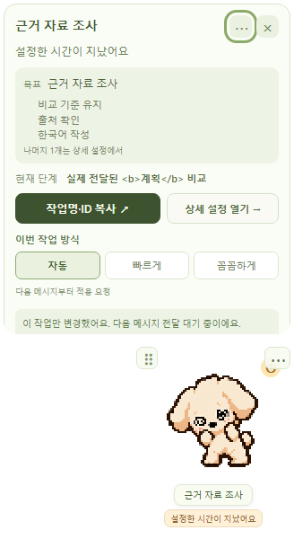

# AutoPets

펫 앱·설정·채팅별 기록·계획/실행 규칙·설치 도구를 구현하고 격리된 환경에서 검사했습니다. 실제 AI 자동 연결, 설정 실수 방지, 공개 설치와 사용자 편익은 다음 검증 단계입니다.

**쓰던 AI는 그대로, 일에 맞는 준비와 설정은 펫이 챙겨준다.**

AI 설정이 낯선 초심자와 매번 설정하기 번거로운 숙련자를 위한 Windows 데스크톱 펫을 만들고 있습니다. 요청과 결과 확인은 기존 AI 채팅에서 하고, 펫에서 도움과 설정을 확인하는 것이 목표입니다.

**[회의용 3분 요약](docs/product/team-brief.md) · [전체 진행 현황·근거](docs/roadmap/project-status.md) · [기여 안내](CONTRIBUTING.md)**

## 현재 단계

**개발 프로토타입 · 공개 설치판 없음 · 실제 AI 자동 연결 미검증**

2026-09-23 기준입니다. 위 요약에는 main과 개발 PR의 구현을 함께 다루되, 반영 위치와 검증 수준을 구분합니다.

| 코드 위치 | 포함된 내용 | 확인 범위 |
|---|---|---|
| main · `529d932` | 펫·설정·로컬 기록·준비 규칙·디렉터리 분리 | [PR #8](https://github.com/swaan-kim/autopets/pull/8) 병합, 격리 검사 |
| [PR #14](https://github.com/swaan-kim/autopets/pull/14) | 계획→실행 프리셋·설정 불일치 보호 규칙 | PR 구현·격리 검사, 실제 보호 비활성 |
| [PR #15](https://github.com/swaan-kim/autopets/pull/15) | 설치 탐색·실행·연결 준비·복구 | PR 구현·격리 검사 |
| [PR #16](https://github.com/swaan-kim/autopets/pull/16) · `4225bdf` | 같은 EXE를 쓰는 설치 버튼·AI 호출, 첫 연결 화면 | PR 구현·격리 검사, 공개 배포 전 |

세 PR은 **#14 → #15 → #16** 순으로 쌓여 있습니다. main을 내려받아도 뒤의 기능이 모두 포함되지는 않습니다. [최신 개발의 Windows CI](https://github.com/swaan-kim/autopets/actions/runs/35700117799)는 통과했지만 실제 AI 지원·서명·사용자 PC 실행을 입증하지는 않습니다.

## 확인된 기능과 남은 검증

| 사용자에게 제공하려는 도움 | 구현된 범위 | 아직 확인하지 못한 것 |
|---|---|---|
| 여러 작업을 펫으로 확인 | 독립 창, 최대 3개 펫, 작업 목록·카드, 숨김·종료 | 실제 채팅의 연속 상태 수신, 최신 네이티브 배율·모니터 검수 |
| 요청에 맞게 준비 | 작업 유형별 짧은 지침과 절차 규칙 | 정상 AI 실행에 자동 전달·반영 |
| 바뀐 조건 유지 | 채팅별 기록 편집·되돌리기·삭제·도움 끄기 | 기존 실행 모델의 자동 기록과 다음 실행 반영 |
| 설정 실수 방지 | 희망 프리셋 저장·계획 확인·불일치 판정(PR) | 모델·추론·Plan 변경과 제출 보호 |
| 결과의 누락 확인 | 형식·길이·필수 항목·URL 존재 검사 | 의미·사실 정확성, 실서비스 자동 보완 |

**설정 저장 ≠ AI 전달 ≠ 실제 적용 확인**입니다. ‘이대로 진행’은 계획 확인을 저장하는 동작이며 채팅 전송이나 모델 변경이 아닙니다. 현재 작업 복귀는 작업명·ID 복사와 수동 안내입니다. 토큰 절감·품질 향상은 아직 측정하지 않았습니다.

펫 표시를 위한 반복 모델 호출이나 실행 중 이미지 생성은 없습니다. 채팅별 업무 기록은 로컬에 분리하며 전체 대화를 별도로 보관하지 않습니다.

## AI별 지원 범위

**실제 자동 적용 검증을 완료한 환경은 아직 없습니다.**

| 환경 | AutoPets의 현재 상태 |
|---|---|
| Windows 로컬 Codex | 관측·준비 훅과 진단 코드. 일반 준비 지침·설정 보호는 비활성 |
| ChatGPT 웹 · Chrome | 확장·Native Messaging 기반. 실제 입력 보조·모델 변경 비활성 |
| ChatGPT Work 로컬 · Codex VS Code | 별도 호환성 검증 대상 |
| Claude Code · Antigravity | 후속 연결 후보. AutoPets 어댑터 미구현 |
| 기타 일반 웹·클라우드 | 안내 범위. PC의 펫과 자동 연결되지 않음 |

공식 서비스에 훅·스킬 기능이 있어도 AutoPets 지원 완료를 뜻하지 않습니다. [화면·실행 위치별 지원표와 제약](docs/roadmap/project-status.md#ai별-지원과-연결-제약)을 확인하세요.

## 체험과 설치 상태

**구현 화면 — 합성 데이터로 검사한 앱 UI**



[main 설정 화면](docs/images/app-settings.png) · [PR의 계획·실행 설정 화면](https://github.com/swaan-kim/autopets/blob/4225bdf51fc3a1074492a788a96bcf374484be39/docs/images/app-workflow-presets.png)

**과거 콘셉트 — 상태 표시 중심의 소개 목업**

[브라우저 체험](https://swaan-kim.github.io/autopets/) · [소개 이미지](docs/images/00-overview-wide.png) · [오프라인 HTML](docs/demo/index.html)

이 목업의 토큰·완료·작업 복귀는 시연 데이터이며 최신 자동 도움의 실연이 아닙니다. 새 제품 소개 `/start/`는 PR 소스에만 있으며 아직 공개되지 않았습니다.

**현재 일반 사용자용 다운로드는 제공하지 않습니다.** GitHub Actions의 파일은 개발·검토용이며 공개 설치판은 아닙니다. [Releases](https://github.com/swaan-kim/autopets/releases)에는 아직 배포가 없습니다.

검증할 설치 흐름은 **설치 버튼 또는 로컬 AI 호출 → 같은 EXE → 펫 앱 → 사용자가 AI 연결 선택 → 필요한 신뢰 확인 → 첫 실제 작업 확인**입니다. 설치·연결 완료를 한 단계로 취급하지 않습니다. 서명·업데이트·첫 연결을 검증한 뒤 설치 안내를 공개합니다.

## 개발과 기여

| 위치 | 역할 |
|---|---|
| `apps/desktop` | React 화면, Tauri/Rust 앱, 펫 자산·화면 검사 |
| `integrations` | Codex 훅·스킬, ChatGPT 확장·로컬 통신 |
| `packages/contracts` | 공통 데이터 형식·검증 |
| `packages/guidance` | 작업 절차·지침·모델 선택·점검 규칙 |
| `docs` | 제품·구조·검수·배포·과거 콘셉트와 회의 자료 |
| `scripts` · `.github` | 검수·패키징·CI·Issue 양식 |

개발 환경은 Node.js 24와 pnpm 11.19.0입니다. 네이티브 빌드에는 Rust MSVC, C++ Build Tools·Windows SDK, WebView2가 필요합니다.

```powershell
pnpm install --frozen-lockfile
pnpm verify:layout
pnpm test
pnpm build
pnpm test:ui
```

`pnpm dev`는 개발 화면, `pnpm desktop`은 네이티브 개발 실행, `pnpm test:rust`는 Rust 검사입니다. [기여 안내](CONTRIBUTING.md)에서 변경 종류별 검사와 오류 신고 방법을 확인하세요.

[내부 구조](docs/architecture/layout.md) · [다음 검증과 회의 안건](docs/roadmap/project-status.md) · [Issues](https://github.com/swaan-kim/autopets/issues) · [Windows 빌드 안내](docs/releases/windows.md)

[MIT 라이선스](LICENSE)로 공개합니다. [펫 이미지 출처·제작 기록](docs/design-source/asset-provenance.md)을 함께 확인하세요. 인증 파일·SQLite·개인 업무 기록·원본 대화는 공개 저장소나 Issue에 올리지 않습니다.
