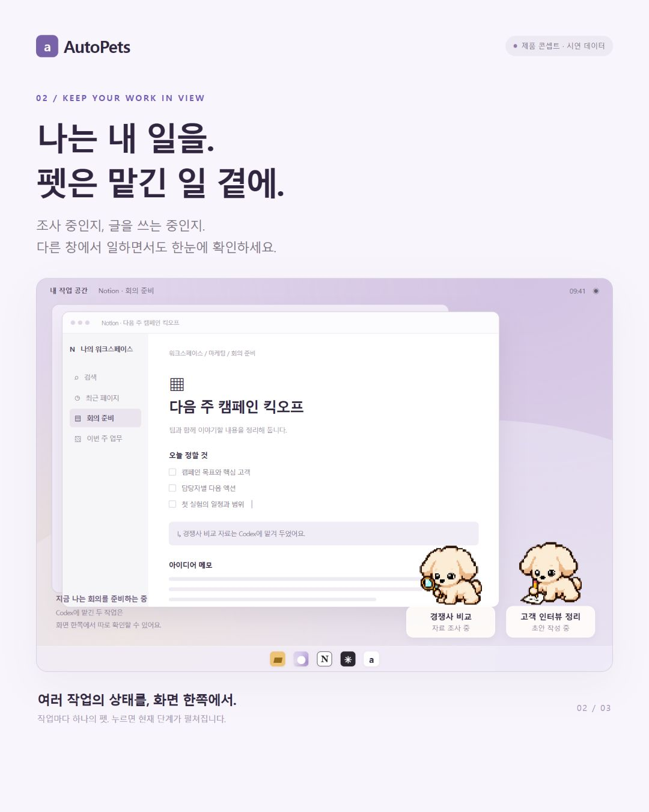

# AutoPets

여러 Codex 작업이 무엇을 하고 있고, 언제 내가 확인해야 하는지 다른 일을 하면서도 알 수 있는 **Windows 독립 픽셀 펫**입니다. Codex에 리서치·문서 작업을 맡기는 실무자를 위한 로컬 앱입니다.



[클릭 목업 HTML](docs/demo/index.html) · [기획·사용자 인터뷰 가이드](docs/product-validation.md)

**Windows CI 빌드 성공:** [c895955의 테스트·NSIS 설치 파일](https://github.com/swaan-kim/autopets/actions/runs/35462024271). Node 22개·Rust 31개·UI 검사 통과, 다운로드 체크섬 일치. 설치 파일은 서명되지 않은 검토용이며 실제 PC 실행과 Codex 훅 연동은 아직 검증하지 않았습니다. [이미지·목업 재생성 방법](docs/design-source/README-제작.md)

## 제공 기능과 현재 상태

- 투명 최상단 펫 창, 작업당 펫 하나·최대 세 개, 트레이 숨기기·종료, 위치 저장.
- 채팅에서 `$autopets`로 완료 기준과 개입 시점 설정. 같은 작업은 재사용하고 첫 빈 슬롯에 연결합니다.
- 실제 계획·도구 이벤트에 맞춘 8프레임 PNG 재생. 실행 중 이미지 생성이나 상태 분류용 모델 호출은 없습니다.
- 관측 시작 후 기본 10분 알림. 변경·끄기·확인·다시 알림을 지원하며 작업을 자동 중단하지 않습니다.
- `milestones` 선택 시 실제 전달된 계획의 단계 완료를 알려줍니다. 일반 질문은 훅에서 관측하지 못할 수 있습니다.

**현재는 네이티브 통합 검증 전 소스 버전입니다.** 작업별 토큰 사용량은 미연결입니다. 특정 Codex 작업 창을 직접 여는 연동은 검증되지 않아 정확한 작업 ID와 찾기 안내를 제공합니다. 직접 승인·거절, 자동 중단, 모델 변경은 제공하지 않습니다. 응답 도착은 목표 달성 판정이 아닙니다.

별도 `AutoPets-concept.zip`에는 오프라인 클릭 목업, 1080×1350 소개 이미지 3장, 기획·인터뷰 가이드가 있습니다. 목업 데이터는 앱의 작업 상태 저장소에 들어가지 않습니다.

## 개발·검증

Node.js 24, pnpm, Rust MSVC, Microsoft C++ Build Tools·Windows SDK, WebView2가 필요합니다. [Tauri 사전 준비](https://v2.tauri.app/start/prerequisites/)

```powershell
pnpm install --frozen-lockfile
pnpm test
pnpm build
pnpm exec playwright install chromium
node scripts/ci-ui.mjs
```

개발 중 생성되는 실행파일을 허용하는 Windows 환경에서만 다음을 실행합니다.

```powershell
cargo test --locked --manifest-path src-tauri/Cargo.toml
pnpm exec tauri dev
```

원 개발 PC에서는 MSVC 의존성의 `build-script-build.exe`가 Windows 앱 제어 정책에 차단되었습니다(`4551`, CodeIntegrity `3077/3033`). 로컬 보안 설정은 변경하지 않습니다. [Windows CI·서명·배포 안내](docs/build-release.md)를 참고하세요. CI 파일이 있다는 것이 빌드 성공이나 설치 실행 검증을 뜻하지 않습니다.

## 앱과 Codex 연결

### 앱 실행

기본 설치 앱 데이터는 `%LOCALAPPDATA%\local.autopets.desktop`에 저장됩니다. 연결 설정에서 정확한 `connection.json` 경로를 확인하세요. 이 파일에는 로컬 인증 비밀이 있으므로 공유하거나 Git에 추가하지 않습니다. `AUTOPETS_DATA_DIR`로 다른 로컬 폴더를 지정할 수 있습니다.

이전 EXE 옆 `.local` 데이터는 삭제하거나 임의 복사하지 않습니다. 기존 데이터를 계속 사용할 때는 이전 폴더를 명시한 뒤 앱을 시작합니다.

```powershell
$env:AUTOPETS_DATA_DIR='C:\AutoPets\release\.local'
```

### 프로젝트 훅 설치

앱을 먼저 실행하고 실제 프로젝트·연결 파일 경로로 바꿔 실행합니다. 먼저 dry-run을 확인하세요.

```powershell
node scripts/install-hooks.mjs install --project 'C:\MyCodexProject' --connection 'C:\Users\YourName\AppData\Local\local.autopets.desktop\connection.json' --dry-run
node scripts/install-hooks.mjs install --project 'C:\MyCodexProject' --connection 'C:\Users\YourName\AppData\Local\local.autopets.desktop\connection.json'
node scripts/check-hooks.mjs --project 'C:\MyCodexProject' --connection 'C:\Users\YourName\AppData\Local\local.autopets.desktop\connection.json'
```

기존 훅은 보존하고 변경 전 파일을 백업합니다. Codex에서 정확한 프로젝트·훅 정의를 검토하고 신뢰해야 합니다. 스킬은 trust·보안 정책을 자동 변경하지 않습니다. [훅 지원 범위](https://learn.chatgpt.com/docs/hooks#tool-coverage)

### 스킬 설치와 호출

`skills/autopets` 전체를 자신의 Codex 스킬 디렉터리에 복사합니다. 예: `%USERPROFILE%\.codex\skills\autopets`. `scripts` 하위 폴더도 함께 필요합니다. 호스트의 스킬 설정에서 실제 설치 위치를 확인하세요.

```text
$autopets 경쟁사 3곳의 차이와 출처를 담은 비교 초안을 만들어줘.
```

이미 나온 완료 기준은 다시 묻지 않습니다. 개입 시점은 `when-needed`(판단·입력이 필요할 때) 또는 `milestones`(주요 단계가 끝날 때도)입니다. 실제 현재 작업을 확인한 후 기존 펫이나 첫 빈 슬롯에 연결합니다. 슬롯이 모두 차면 다른 작업을 덮어쓰지 않습니다. 수동으로는 ‘나의 펫 → 작업 연결’을 사용합니다.

앱이나 실제 이벤트가 연결되지 않았으면 성공으로 표시하지 않습니다. 원래 Codex 작업은 가능한 범위에서 계속합니다.

### 사용 중

펫을 클릭하면 완료 기준·최근 활동·전달된 계획·관측 시간·알림이 나옵니다. 현재 ‘Codex 작업 찾기’는 정확한 작업 ID와 경로를 제공하며 자동 창 복귀는 미지원입니다.

시간 알림은 한 번 발생하고 확인 후 반복되지 않습니다. 다시 알림은 사용자가 선택한 경우에만 발생합니다. 권한 요청은 Codex에서 처리합니다. 작업별 토큰 데이터가 없으면 숫자나 과소비를 추정하지 않습니다.

관리 창 닫기는 트레이 숨김입니다. 트레이의 AutoPets 종료로 앱과 브리지를 종료합니다.

훅 해제:

```powershell
node scripts/install-hooks.mjs uninstall --project 'C:\MyCodexProject' --dry-run
node scripts/install-hooks.mjs uninstall --project 'C:\MyCodexProject'
```

## 구조와 검증 기록

React/TypeScript UI, Tauri 2/Rust 창·트레이·로컬 브리지, SQLite 상태 저장소, Node 훅 어댑터 및 독립 연결 스크립트가 포함된 스킬로 구성됩니다. PNG 아틀라스는 256×128, 프레임당 64×64, 약 16KB입니다.

[현재 검증 상태](docs/implementation-status.json), [내부 프로토콜](docs/protocol.md), [빌드·배포 안내](docs/build-release.md)를 참고하세요. 이전 승인 제어 실험의 기록은 현재 기능 범위와 구분해야 합니다. 실제 Desktop 이벤트, 설치 실행, 다중 모니터·DPI·절전·위치 복원은 네이티브 실행 환경에서 검증해야 합니다. 사용자 인터뷰는 아직 실시하지 않았습니다.
