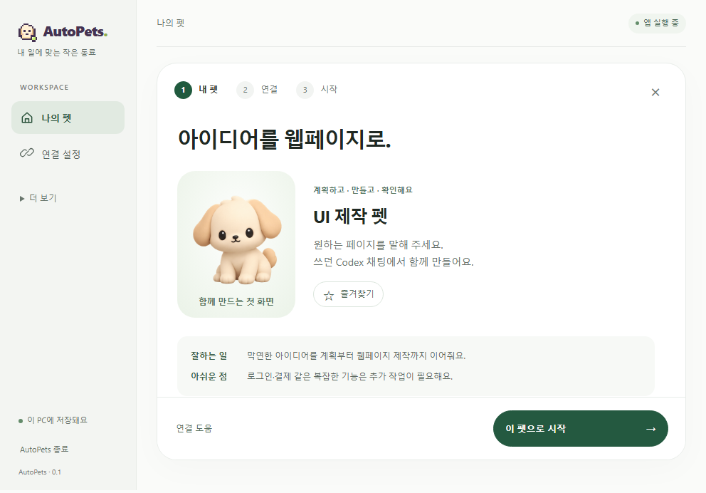

# AutoPets

**쓰던 Codex 채팅에서 펫에게 계획과 구현을 맡기고, 진행과 결과를 확인하는 Windows 앱입니다.**

펫에 일하는 방법과 실행 설정을 저장합니다. 사용자는 펫을 부르고 할 일을 말한 뒤 계획을 확인합니다. AutoPets는 저장된 설정에 맞는 하위 작업과 펫의 상태를 연결합니다. 현재 대상은 **Windows 로컬 Codex의 명시적 펫 호출**입니다.

[개발 미리보기 다운로드](https://github.com/swaan-kim/autopets/releases/tag/v0.1.0-dev.20261005) · [남은 개발 계획](docs/roadmap/mvp-execution.md) · [실제 사용자 검사](docs/testing/oneflow-happy.md) · [검증 기록](docs/testing/mvp-feasibility.md)

> **개발 미리보기입니다.** 설치 파일은 미서명이며 Windows 보안 정책에 따라 차단될 수 있습니다. 서명된 일반 사용자 배포와 최신 UI 펫의 전체 사용자 흐름 검증은 아직 남아 있습니다. 보안 설정 해제를 설치 조건으로 안내하지 않습니다.

## 어떤 도움을 주나요?

- **펫을 보고 선택** — 한 줄 설명, 잘하는 일과 한계, 결과 예시로 맡길 일을 이해합니다. UI 제작 펫은 출처와 버전을 고정한 `Anthropic frontend-design` 스킬을 사용합니다.
- **즐겨찾기로 다시 부르기** — 자주 쓰는 펫과 저장한 구성을 모아 두고 다시 사용합니다.
- **쓰던 채팅에서 작업** — 준비한 요청을 기존 Codex 채팅에 보내 계획과 구현을 이어갑니다. 새 채팅 서비스를 만들거나 작업을 자동 전송하지 않습니다.
- **설정을 반복해서 고르지 않기** — 가볍게·표준·꼼꼼하게를 저장하고, 펫의 하위 작업에 적용합니다. 실제 실행 기록으로 적용 여부를 확인합니다.
- **진행과 다음 행동 확인** — 계획 확인 필요, 제작 중, 결과 확인, 완료를 구분합니다. 펫에서 연결된 Codex 작업 열기를 요청할 수 있습니다.



*실제 앱 화면 코드에 예시 데이터를 넣은 개발 화면입니다. 실제 AI 실행이나 설치형 전체 흐름의 증거가 아닙니다. [상태별 모습과 동작 영상](docs/images/mvp-20261005/README.md)*

## 처음 사용하는 흐름

1. **이 펫으로 시작** — UI 제작 펫의 역할을 확인합니다. 첫 예시는 가상 학과 행사 소개 웹페이지 한 장입니다.
2. **Codex에 펫 준비** — 앱에서 펫 호출 스킬을 준비합니다. Figma는 기본 꺼짐인 선택 기능이며 기본 제작에는 필요하지 않습니다.
3. **맡길 일 → 시작 요청 복사** — 원하는 작업을 적고, 요청을 사용할 Codex 채팅에 직접 보냅니다. 저장한 펫 ID·개정과 계획 지침이 포함됩니다. 복사만으로 연결되지는 않습니다.
4. **계획 확인 → “그대로 구현해줘”** — 같은 채팅에서 요청합니다. 자연어로 호출되지 않으면 **AutoPets 스킬을 직접 선택**합니다.
5. **펫 상태 → Codex 작업 열기 → 결과 확인** — 결과는 Codex가 반환한 링크에서 확인합니다. OS에 열기를 요청한 것과 정확한 채팅에 도착한 것은 구분합니다.

마음에 드는 구성을 즐겨찾기에 저장하면 다음에도 다시 준비할 수 있습니다. 도움 끄기·숨기기·종료·연결 복구는 앱에서 관리합니다. [상세 사용 안내](docs/product/ui-pet-mvp.md)

| 단계·선택 | 펫의 하위 작업 설정 |
|---|---|
| 계획 | Luna · low |
| 제작 — 가볍게 | Luna · low |
| 제작 — 표준 | Sol · low |
| 제작 — 꼼꼼하게 | Sol · medium |

해당 호스트에서 사용 가능한 조합인지 실행 전에 확인하며, 사용할 수 없으면 임의로 대체하지 않습니다. **부모 채팅의 모델은 유지됩니다.** 계획 중 파일을 바꾸지 않는 동작은 계획 프롬프트 이행이며 실제 Plan 모드 강제가 아닙니다. 사용량 절감이나 품질 향상 수치는 아직 주장하지 않습니다.

## 현재 개발 상황 — 2026-10-05

입체감 있는 사전 제작 펫과 간결한 소개 화면을 추가했습니다. 계획·제작·확인 대기·완료·오류에 맞춰 표시하며, 동작 줄이기·숨김·기존 이미지 복원을 지원합니다. [이번 검사와 조건](docs/testing/friendly-mvp.md).

| 항목 | 확인한 범위 | 남은 확인 |
|---|---|---|
| 기존 제작 펫 `5ec2fd0` | 현재 PC에서 일반 입력 계획·구현·검토, 실제 모델·강도, A/B 격리, 도움 끄기·정상 재시작 통과 | 다른 PC·다른 호스트로 확대하지 않음 |
| 간결한 시작 화면과 채팅 복귀 `928186e` | Windows CI, 현재 PC 설치·실행, 저장 구성·연결 안내·요청 복사 확인 | 최신 UI 펫의 실제 계획부터 결과까지, 정확한 채팅 도착·초안 보존 |
| 즐겨찾기·소개·내 작업 입력 | 화면 구현, 재사용·저장 실패·한글 여러 줄·오래된 개정 보호 검사 | 새 설치본의 실제 사용자 흐름 |
| 최신 변경의 로컬 검사 | Node **223 통과 / 조건부 1 건너뜀**, 전체 UI 검사·페이지 오류 0, 화면 빌드·구조 검사 통과 | Windows 결과·정확한 설치본 해시는 각 Release에 기록 |
| 최신 설치본 `079a1e1` | Windows 전체 검사, 현재 PC 업데이트·새 펫·로컬 통신·DB/설정 보존, B 기존 작업 복구. PR #19 병합·개발 Pre-release 공개 | 정상 종료·재시작·B 도움 끄기/복구도 확인. A 일반 입력·정확한 채팅 도착과 보안 정책을 켠 PC는 남음 |
| UI 펫의 실제 작업 | 계획 Luna/low → 구현 Sol/low → 앱 설정 변경 후 Sol/medium 검토, 요청별 자식 1회·B 격리·결과 페이지 확인 | 일반 입력창·최신 설치본 복구·정확한 채팅 도착은 별도; 암호화된 위임 입력 원문은 미확인 |
| Figma 선택 기능 | 연결 안내·프레임 입력·사용 근거 표시 구현, 시험 시안 읽기 사전 확인 | 펫의 실제 계획·구현에서 시안 반영 |
| 배포 | GitHub 소스와 미서명 개발 미리보기 | 공인 서명·보안 정책 유지·다른 PC 설치/업데이트 검증 |

10월 1일 현재 PC 설치 성공은 **사용자가 Smart App Control을 끈 조건**에서 확인했습니다. 보호가 켜진 일반 사용자 PC의 설치 성공으로 계산하지 않습니다. 최신 UI 변경은 이전 설치본과 구분하며, 설치 파일의 버전 표시가 같아도 **Release 태그·소스·SHA-256**으로 식별합니다.

**최신 UI 제작 펫의 설치형 전체 흐름은 아직 미통과입니다.** 실제 시험은 현재 51/72턴입니다. 도구로 전달한 시험과 일반 입력창 체험은 구분합니다. Dot은 로그인·PC 연결 조건을 조사했으며 사용자 선택에 따라 실제 연결 검사를 보류했습니다.

자동 훅 처리, 모든 요청의 자동 라우팅, 부모 모델 변경, 실제 Plan 강제, 자동 재전송, Work·Chat·Jev·공유 사이트는 현재 지원 범위에 포함하지 않습니다. 기존 실험 코드가 있어도 지원이 확인됐다는 뜻은 아닙니다.

## 남은 계획

| 순서 | 할 일 | 끝내는 기준 |
|---|---|---|
| **1. 기본 사용자 흐름** | 최신 설치본에서 펫 준비 → 계획 → 명시적 구현 → 결과 페이지 → 같은 채팅 복귀 | 계획 Luna/low·파일 불변, 구현 Sol/low·자식 1회, 실제 지침/스킬 근거·결과물·A/B 격리 확인 |
| **2. 재사용과 복구** | 즐겨찾기 재호출, 꼼꼼하게 검토, 도움 끄기, 정상 종료·재시작, 숨김·배율 | Sol/medium 검토·파일 불변, 꺼짐 시 새 작업 0회, 설정·기록·초안 보존, 잘못된 완료 표시 0건 |
| **3. 선택형 Figma** | 전용 B에서 준비된 프레임으로 계획·구현 | 실제 시안 읽기와 결과 반영 확인. 기본 제작 통과와 별도 판정 |
| **4. 일반 사용자 배포** | 서명 경로 확정, 앱·제거기·설치기 검증, 다른 PC 설치·업데이트·복구 | 보안 정책을 유지한 설치, 개발 도구 없는 PC·일반 권한·한글 경로·데이터 보존 확인 |
| **5. 사용자 편익 확인** | 소규모 첫 사용자 체험과 기본 AI 사용 비교, 용어 최종 정리 | 완료 여부·설정 조작·재작업·품질·시간을 기록하고 막힌 부분 개선 |
| **그 이후** | 두 번째 펫 → MCP 하나 → Work → Jev 판단 연결·공유 사이트 | 단계마다 실제 연결과 실행을 따로 통과한 뒤 확대 |

실제 AI 검사는 **누계 72턴 안에서** 진행합니다. 기존 완료 요청을 반복하지 않고, 같은 원인은 수정 후 최대 두 번만 재검사합니다. 로그인·신뢰 검토·서명 자격 같은 외부 조건은 우회하지 않습니다. 기본 흐름과 Figma, Dot, 서명 배포의 판정은 각각 남기며, GitHub 업로드를 MVP 전체 통과로 계산하지 않습니다. [세부 체크포인트와 중단 기준](docs/roadmap/mvp-execution.md)

## 설치 파일과 개발

[GitHub Releases](https://github.com/swaan-kim/autopets/releases)에서 **Pre-release**의 설치 EXE, SHA-256과 빌드 기록을 함께 확인하세요. 차단되면 해당 파일 실행은 중단하고 서명된 배포본을 기다립니다. 안정판 채널과 자동 업데이트는 아직 비활성입니다. [배포 안내](docs/releases/start.md) · [서명 준비](docs/releases/code-signing.md) · [Windows 빌드](https://github.com/swaan-kim/autopets/actions/workflows/windows.yml)

개발에는 Node.js 24와 pnpm 11.19.0을 사용합니다. 네이티브 빌드에는 Rust MSVC, Microsoft C++ Build Tools·Windows SDK와 WebView2가 필요합니다.

```powershell
pnpm install --frozen-lockfile
pnpm verify:layout
pnpm test
pnpm build
pnpm test:ui
pnpm test:rust
node scripts/validate-release.mjs
```

`pnpm dev`는 개발 화면, `pnpm desktop`은 네이티브 개발 실행입니다. 설치 패키지는 런타임과 연결 도구를 포함합니다. [빌드 안내](docs/releases/windows.md)

| 위치 | 내용 |
|---|---|
| `apps/desktop` | React 화면·Tauri/Rust·펫 자산·화면 검사 |
| `integrations/codex` | 스킬·연결·실행 관측·검사 |
| `integrations/chatgpt` | 별도 검증 중인 확장·Native Messaging |
| `packages/contracts`, `packages/guidance` | 공통 형식·지침·라우팅 정책 |
| `scripts`, `.github` | 검사·패키징·CI |
| `docs` | 제품·구조·계획·검증·배포 기록 |

기존 앱 ID `local.autopets.desktop`과 데이터 위치를 유지합니다. DB·인증값·개인 작업·로컬 진단은 Git에 올리지 않습니다. [내부 구조](docs/architecture/layout.md) · [기존 단계 기록](docs/roadmap/implementation.md)

[공개 소개·체험 목업](https://swaan-kim.github.io/autopets/)은 시연 데이터로 만든 콘셉트입니다. 실제 앱의 연결이나 배포 상태는 이 README와 Release를 기준으로 확인하세요.
