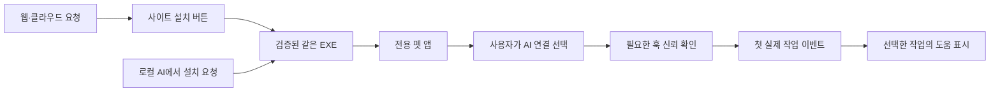

# 설치·연결·업데이트 계약

## 소유권

앱 ID `local.autopets.desktop`, 기존 데이터 위치와 SQLite는 보존한다. 직접 배포·AI 호출·Store EXE가 같은 사용자 설치를 찾는다. NSIS와 앱의 single-instance 처리, 연결 도구의 소유권 기록·설치 잠금으로 중복 설치/훅/펫 생성을 막는다. `InstallManifest`가 AutoPets 소유 파일과 훅만 관리한다. 사용자 제작 스킬, 다른 훅, Codex trust는 덮어쓰지 않는다.

설치 EXE는 `connector/` 자원에 런타임과 실행 모듈을 넣는다. 앱의 명시적인 연결 명령만 bundled Node를 실행한다. 관측 훅은 앱을 실행·다운로드하지 않는다. 종료 상태는 다음 사용자 실행까지 유지된다.

## 상태의 증거

- 앱 준비: 설치된 실행 파일과 인증된 로컬 통신.
- AI 연결 설정: 선택한 호스트의 소유 훅 준비. 허용 완료를 뜻하지 않는다.
- 첫 작업 확인: 연결 시점 이후의 실제 작업 이벤트. 놓친 과거 이벤트나 임의 세션을 만들지 않는다.
- 지침 전달: 해당 작업의 별도 수신 증거. hook stdout만으로 완료를 선언하지 않는다.
- 설정 보호: 모델·추론·Plan·보류 각각 검증. 카탈로그나 fixture의 성공은 실제 기능 활성화 조건이 아니다.

`SetupState`의 연결 상태는 서비스 이름 외에 제공자·실행 화면·로컬/클라우드·버전을 구분한다. 기존 엄격한 assistance Provider/채팅 저장 형식은 유지하며 미래 제공자의 기록을 기존 Codex 기록으로 넣지 않는다. 미지원 호스트는 안내만 제공한다.

## 단일 업데이트 경로

직접 배포와 Store EXE 모두 앱의 Tauri updater를 사용한다. 자동 백그라운드 검사 없이 설정창의 요청으로 확인한다. 공개 키는 릴리스 빌드의 `AUTOPETS_UPDATER_PUBLIC_KEY`로 바이너리에 넣는다. 키 없는 리뷰 빌드는 업데이트 비활성이다. 웹뷰·외부 manifest가 신뢰 키를 바꿀 수 없다.

고정 발견 주소는 `https://swaan-kim.github.io/autopets/updates/windows-x64.json`이다. 이 주소의 메타데이터는 새 버전을 가리킬 수 있지만 설치 파일은 항상 해당 버전의 GitHub Releases EXE여야 한다. 앱은 저장소·버전·확장자와 서명 존재를 확인하고, Tauri가 다운로드한 바이트의 서명을 검증한 후 실행한다. 한 번 확인한 버전에만 설치를 요청할 수 있으며 동시 설치를 직렬화한다.

Windows Authenticode와 updater 서명은 별개다. 공개 빌드에서는 EXE와 포함 PE의 Authenticode를 확인한 다음, 최종 설치 EXE에 대한 updater `.sig`를 만든다. `bundle.createUpdaterArtifacts=true` 및 `TAURI_SIGNING_PRIVATE_KEY`를 빌드 환경에 설정해야 한다. 개인 키는 저장소에 넣지 않는다. 이번 리뷰에는 공개 키·인증서·실제 업데이트 서버가 없으며 배포/업데이트 왕복은 미검증이다.

`requireSignedVersion:true`와 `allowDowngrades:false`로 버전이 서명되지 않은 업데이트와 하향 설치를 거절한다. 현재 잠긴 Tauri CLI 2.11.4의 기본 서명에는 버전이 포함되지 않으므로 그대로 공개 업데이트를 만들 수 없다. 버전 서명을 지원하는 도구로 검수한 뒤 공개한다. 이 관문을 통과시키기 위해 서명 정책을 끄지 않는다.

## 공개 manifest

`docs/releases/channel.json`은 버전 2이며 공개 전에는 `publicRelease:null`이다. `packages/contracts/release.mjs`는 다음 선언을 검증한다.

- 고정 태그와 같은 버전의 GitHub EXE URL, SHA-256, 발행자 인증서 thumbprint.
- 같은 제품의 업데이트 발견 주소와 공개 키.
- 깨끗한 Windows, Windows 실행, Codex 두 채팅, 지침 전달, 복구/제거, Authenticode, updater 서명 검수 선언.

사이트 생성기와 AI 설치 도구는 이 계약을 따른다. 선언 검사는 실제 파일 서명 확인이나 사용자 테스트를 대신하지 않는다. 잘못된 manifest는 공개 사이트 생성에서 실패하며, 공개 전 상태는 사이트 다운로드를 열지 않는다. `node scripts/validate-release.mjs --public`은 공개 전 상태에서 의도적으로 실패한다.

[Tauri updater](https://v2.tauri.app/plugin/updater/) · [Store 설치 요건](https://learn.microsoft.com/en-us/windows/apps/publish/publish-your-app/msi/app-package-requirements) · [제품 범위](../product/distribution.md)
