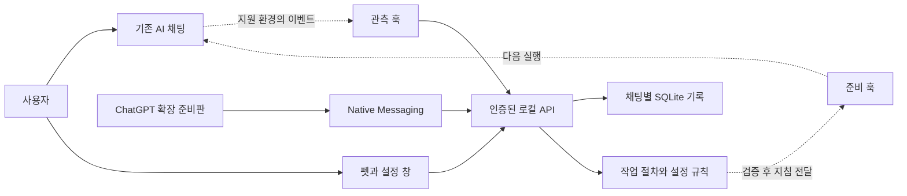

# AutoPets 진행 현황과 팀 회의 자료

펫 앱·설정·채팅별 기록·계획/실행 규칙·설치 도구를 구현하고 격리된 환경에서 검사했습니다. 실제 AI 자동 연결, 설정 실수 방지, 공개 설치와 사용자 편익은 다음 검증 단계입니다.

**기준일: 2026-09-23.** 이 문서는 활동·구현·검증을 정리한 회의 자료입니다. 지원 AI, 첫 출시 기능, 홍보와 설치 채널의 최종 선택은 아래 결정표에 남깁니다.

[회의용 3분 요약](../product/team-brief.md) · [코드·검사 기준](#코드와-검증-기준점) · [기능과 편익](#기능편익확인-범위) · [AI별 지원](#ai별-지원과-연결-제약) · [회의 안건](#회의에서-결정할-사항)

## 먼저 구분해서 읽기

| 표시 | 의미 | 아직 의미하지 않는 것 |
| --- | --- | --- |
| main 반영 | 공개 저장소 기본 브랜치에 구현이 들어 있음 | 실제 AI 연결·사용자 효익 검증 완료 |
| PR 구현 | 검토 브랜치에 코드가 있으나 main 미반영 | 사용자가 기본 소스를 받으면 해당 기능 사용 가능 |
| 격리 검사 | 가상 입력·시험 서버·자동 화면·CI로 확인 | 실제 계정·AI 화면·PC에서 같은 동작 보장 |
| 실제 확인 | 지정된 버전·PC에서 관측한 사실 | 다른 버전·환경까지 지원 |
| 미검증 | 확인 증거 없음 또는 의도적으로 비활성 | 반드시 불가능하다는 결론 |

## 코드와 검증 기준점

| 기준 코드 | 상태 | 포함 범위 |
| --- | --- | --- |
| [main · `529d932`](https://github.com/swaan-kim/autopets/tree/529d932251533edd5ed8f42d845f5527c11dc949) | PR #8 병합 | 앱·연결·공통 코드 분리, 도움 설정·기록, 펫 UI, 기존 홍보 데모 |
| [PR #14](https://github.com/swaan-kim/autopets/pull/14) | 열림 | 계획·실행 프리셋과 검증 조건을 둔 제출 보호 |
| [PR #15](https://github.com/swaan-kim/autopets/pull/15) | 열림 | 설치·실행 도구, 사용자 범위 연결, 런타임 동봉 |
| [PR #16 · `4225bdf`](https://github.com/swaan-kim/autopets/tree/4225bdf51fc3a1074492a788a96bcf374484be39) | 열림, 최신 후속 구현 | 앞선 변경을 포함한 단일 EXE·설치/AI 두 입구·첫 연결 화면 |

**아래 ‘구현’은 main과 PR을 함께 조사한 결과입니다.** PR #16 파일은 고정 커밋 링크로 표시합니다. 검토 빌드는 공개 설치 제품과 구분합니다.

저장소는 이미 **public·MIT**입니다. PR #14는 main, #15는 #14의 브랜치, #16은 #15의 브랜치를 대상으로 하므로 후속 기능을 독립된 세 제품처럼 읽지 않습니다. 검토 후 병합할 때는 이 순서와 대상 브랜치를 다시 확인해야 합니다. 이번 문서 정리는 기능 PR을 병합하지 않습니다.

**공개 설치용 Release는 0개**이고 Store·AI 플러그인 디렉터리 등록도 하지 않았습니다. [기존 Pages](https://swaan-kim.github.io/autopets/)는 과거 콘셉트 데모로 열리지만 새 `/start/` 주소는 조사 시점에 404입니다. [새 소개 페이지 소스][product-site]와 [공개 전 배포 상태][release-channel]는 PR에만 있습니다. 설치 성공·AI 연결·지침 전달·설정 보호는 각각 따로 확인해야 합니다.

## 지금까지 한 활동

초기 대화에서 정한 방향은 이후 여러 번 바뀌었습니다. 날짜는 확인 가능한 Git 기록을 기준으로 하며, 초기 아이디어 논의의 정확한 날짜는 추정하지 않습니다.

| 시기 | 활동과 변화 | 남긴 결과·근거 |
| --- | --- | --- |
| 초기 논의 | 웹 화면 속 캐릭터에서 다른 앱 위 독립 펫으로 방향 설정 | 현재 데스크톱 창 구조로 이어짐 |
| 초기 논의 | 매번 이미지 생성 대신 픽셀 이미지 재사용, 짧은 문구와 계획 단계 연결 | 실행 중 이미지 생성·상태 판별용 반복 모델 호출 제외 |
| 09-20 | 기본 펫 앱·작업 상태·로컬 연결·Windows CI 구현 | [초기 구현 `8b5b758`](https://github.com/swaan-kim/autopets/commit/8b5b758) |
| 09-20 | 로고·소개 이미지·클릭 목업 제작, 조사→작성→도구→결과 흐름 정리 | [소개 이미지](../images/00-overview-wide.png), [목업 소스](../demo/index.html) |
| 09-20 | 고민·어지러움·오류·기쁨 모션 추가, 설명 축소, Pages 공유 | [모션 상태표](../images/04-motion-states.png), [공개 콘셉트 데모](https://swaan-kim.github.io/autopets/) |
| 09-20 | 과거 빌드의 실제 Windows 설치·실행·인증된 로컬 통신 시험 | [M1 당시 기록](../testing/m1-evidence.md); 서명 없음, 실제 두 채팅 미검증 |
| 09-20~21 | 상태 표시에서 준비·기억·조절로 기능 확장 | [제품 정의](../product/direction.md), [도움 구현 검수](../testing/assistance-implementation.md) |
| 09-21 | 채팅별 기록·선호·빠른 카드·되돌리기·끄기·숨기기·종료 구현 | [PR #8](https://github.com/swaan-kim/autopets/pull/8) |
| 09-21 | 불편한 혼란 모션을 정지 포즈로 변경 | [수정 `fadf5eb`](https://github.com/swaan-kim/autopets/commit/fadf5eb) |
| 09-21 | 앱·연결·규칙별 디렉터리 및 내부 파일 분리, 호환 진입점 유지 | M2·하위 Issue #9~#13 종료, PR #8 main 병합 |
| 09-21 | 계획 모델과 실행 모델을 나누는 후보 프리셋·계획 확인·제출 보호 규칙 추가 | PR #14; 실제 설정 변경과 보호는 비활성 |
| 09-22 | 설치 확인→실행→연결 준비를 묶는 시작 도구, 재호출·복구·중복 처리 추가 | PR #15; 기존 사용자 설정·다른 훅 보존 |
| 09-22 | 제품 사이트 설치 버튼과 AI 호출을 같은 설치 EXE로 통합하는 구현 | PR #16; 앱 준비→AI 연결→첫 작업 확인 |
| 09-23 | 대표 제품·실제 코드·지원표·GitHub 상태를 대조해 팀 공유 자료 준비 | 본 문서; 새 지원·효익 검증을 수행한 것은 아님 |

## 기능·편익·확인 범위

‘기대 편익’은 제품 가설입니다. 동작 코드가 있다는 이유만으로 사용자의 시간·토큰 절감이나 결과 품질 향상이 확인된 것은 아닙니다.

| 기능 | 사용자가 하게 될 행동 / 기대 편익 | 현재 구현 | 확인 범위와 간극 |
| --- | --- | --- | --- |
| 독립 펫 | 다른 업무 중 진행을 보고 확인 횟수를 줄임 | main: 투명·항상 위 창, 최대 3개, 위치 저장·트레이 | 과거 PC에서 창 존재 확인; 최신 DPI·다중 모니터·포커스 검수 필요 |
| 상태·알림 | 조사·작성·도구·확인 요청·오류를 구분 | main: 이벤트 규칙·18프레임·시간 알림·갱신 시각 | 실제 이벤트 범위에 의존; 응답 종료를 목표 달성으로 단정하지 않음 |
| 작업 목록·복귀 | 필요한 작업을 빨리 찾음 | main: 목록·필터·작업명/ID 복사 | **현재 직접 채팅 열기 아님**. 사용자가 같은 ID의 작업을 찾아야 함 |
| 자동 준비 | 긴 프롬프트·계획을 매번 작성하는 수고 감소 | main: 네 종류 작업 절차·짧은 지침 생성 | 한국어 키워드 규칙. 일반 배포의 자동 지침 전달은 비활성 |
| 채팅별 기억 | 바뀐 조건의 반복 설명 감소 | main: 목표·조건·결정·남은 일 저장/수정/삭제/되돌리기 | 로컬 저장 확인과 모델 전달 확인은 별개. 실제 자동 동기화 미검증 |
| 내 방식 설정 | 기능명을 몰라도 원하는 방식 선택 | main: 자동/빠르게/꼼꼼하게, 답변 길이·형식·허용 범위 | 설정 저장 가능; 실제 모델·Plan 변경 아님 |
| 계획→실행 프리셋 | 높은 모델을 그대로 두는 설정 실수 예방 | PR #14~16: 세 카드, 단계별 희망값, 계획 확인·개정 관리 | ‘이대로 진행’은 확인 저장. 실제 전송·모델 변경은 별도 |
| 제출 전 보호 | 설정 불일치 시 실행 전에 확인 | PR #14~16: 보류·예외·중복·오류 시 통과 규칙 | 실제 제출 보존·한 번 전송이 확인되지 않아 비활성 |
| 결과 점검 | 요구한 형식과 빠진 항목 찾기 | main: 문자열·길이·표·출처 URL 존재 검사, 한 번 보완 조건 | 의미·사실·출처 정확성 검증 아님. 자동 보완 실행 미연결 |
| 끄기·데이터 관리 | 방해를 줄이고 기록을 직접 관리 | main: 이번 채팅 끄기·펫 숨기기·앱 종료·기록 삭제 | 화면/저장 검사 있음; 새 설치부터 종료·제거까지 실환경 시험 필요 |
| 설치·AI 호출 | 개발 도구 없이 설치하고 같은 앱 실행 | PR #15~16: 탐색·잠금·복구·Node/LICENSE 동봉·첫 연결 | 공개 Release·서명·일반 PC 원큐 경험은 미검증 |

구현 화면: [펫 카드](../images/app-pet-card.png) · [설정](../images/app-settings.png). 모두 fixture 데이터로 확인한 화면이며 실제 AI 전달의 증거는 아닙니다.

PR의 계획→실행 설정은 다음 **평가 후보**입니다. 저장한 희망값이며 계정의 실제 모델 가용성·자동 적용·절감 효과를 검증한 조합은 아닙니다. [프리셋 구현과 설계][planning-execution]

| 카드 | 계획 희망값 → 실행 희망값 |
|---|---|
| 가볍게 끝내기 | Sol Medium → Luna Low |
| 균형 있게 | Sol Medium → Terra Medium |
| 어려운 일 풀기 | Astra High → Astra Medium |

현재 흐름과 목표 흐름은 다음처럼 구분합니다.

- **현재 개발 검수:** 소스/검토 빌드 실행 → 펫·설정·기록 확인 → 시험 이벤트/가상 데이터로 화면 검수 → 저장 결과 확인.
- **목표 사용자 경험:** 설치 버튼 또는 AI 호출 → 앱 실행 → 사용자가 AI 연결 → 신뢰 확인 → 평소 요청 → 도움·설정 확인 → 결과 점검 → 필요 시 끄기.
- 두 번째 흐름 전체를 개발 도구 없는 PC와 실제 AI 채팅에서 통과한 기록은 아직 없습니다.

## AI별 지원과 연결 제약

서비스 이름만 같아도 Desktop·CLI·VS Code·웹·클라우드는 다른 연결 환경입니다. ‘코드 있음’은 해당 환경에서 지원이 확인됐다는 뜻이 아닙니다.

| AI / 실행 화면 | 실행 위치 | 현재 수준 | 다음 확인 |
| --- | --- | --- | --- |
| Codex Desktop · Windows | 로컬 | 관측/준비 훅·연결·설정 관측 코드 있음, 실환경 미검증 | 새 두 채팅의 상태·지침·기록, 신뢰·재시작, 설정 관측 |
| Codex CLI · Windows | 로컬 | 공통 훅 형식을 사용한 진단 경로 있음; Desktop 결과로 대신 증명 불가 | CLI 버전·설정 범위·실제 이벤트·지침을 독립 확인 |
| Codex · VS Code | 로컬 호스트 | PR 지원 카탈로그의 호환성 검증 대상 | 같은 훅/기록/복귀 도구가 작동하는지 |
| ChatGPT Work · 로컬 | 로컬 호스트 | PR 카탈로그의 호환성 검증 대상 | 실제 실행 위치·훅 적용 범위·작업 식별 |
| ChatGPT · Chrome 웹 | 브라우저 / 서비스는 클라우드 | 확장·Native Messaging 상태 조회 준비판 | 계정·채팅 식별, 입력 보존, 실제 지침 전달 방법 |
| ChatGPT 일반 Desktop / Work 클라우드 | 별도 앱 / 클라우드 | 자동 연결 미검증, 공통 안내 범위 | 로컬 PC 연결 가능 경로부터 확인 |
| Claude Code · Desktop Code 탭 | 로컬 | PR 카탈로그·후속 계획, 연결 구현 없음 | 공식 훅/스킬과 해당 화면의 적용 관계 |
| Claude Code · CLI / VS Code | 로컬 | 후속 후보; CLI와 VS Code 각각 검증 필요 | 상태·준비·설정·복귀를 기능별 확인 |
| Antigravity · IDE | 로컬 | PR 카탈로그·후속 계획, 연결 구현 없음 | IDE의 훅·지침·모델 관측과 설정 범위 |
| Antigravity · CLI | 로컬 | 별도 검증할 후보, 연결 구현 없음 | CLI 버전·훅·가용 정보. IDE의 성공으로 대신 증명 불가 |
| Claude / Gemini 일반 웹 | 클라우드 | 안내만, 자동 연결 구현 없음 | 브라우저별 입력·설정 지원 가능성 |

최신 [연결 카탈로그][connections]에는 **검증 완료로 활성화된 환경이 없습니다.** 연결 버튼이 있는 Codex도 설정 준비와 실제 활동 수신을 구분합니다.

| 핵심 능력 | 지금 설명 가능한 범위 |
| --- | --- |
| 상태 읽기 | Codex 이벤트 어댑터 구현. 실제 사용자 환경 검증 필요 |
| 스킬·지침 전달 | Codex 준비 helper 구현. 진단 모드 외 일반 capability는 비활성 |
| 모델 관측 | 훅의 `model` 활용 경로 구현. 실제 제출에서 확인해야 함 |
| 모델·추론·Plan 변경 | 기존 AI 창을 변경하는 검증된 어댑터 없음 |
| 제출 보류 | 정책·출력 규칙 구현. 원문·첨부·재전송 실증 전 비활성 |
| 작업별 토큰 | 실제 사용량 지원 없음. 추정치로 대체하지 않음 |
| 정확한 작업 복귀 | 현재 작업명·ID 복사와 수동 안내 |

공식 [Codex 훅 문서](https://learn.chatgpt.com/docs/hooks)는 현재 모델, 메시지 제출 이벤트, 추가 지침·보류 출력을 설명합니다. 공통 `permission_mode`에 `plan` 값이 있더라도, 이것이 우리가 표시하려는 네이티브 Plan 협업 모드와 같은지는 미검증이며 현재 코드는 매핑하지 않습니다. 추론 수준·첨부 식별까지 확인된 것으로 확대하지 않습니다.

[Claude Code 공식 스킬](https://code.claude.com/docs/en/skills#frontmatter-reference)은 해당 턴의 `model`·`effort` 설정 후보를 제공합니다. 다음 요청에도 유지되는 세션 모델 변경과는 다릅니다. [Antigravity 공식 훅](https://antigravity.google/docs/hooks)은 호출 전후·도구 이벤트를 제공하지만, 우리 어댑터 구현이나 자동 모델 변경의 증거는 아닙니다. [Chrome Native Messaging](https://developer.chrome.com/docs/extensions/develop/concepts/native-messaging)은 확장과 로컬 프로그램의 통신 방식이며 AI 사이트의 모델 제어 API를 제공하지 않습니다. 공식 문서 확인일도 2026-09-23입니다.

## 구조와 어려운 연결 지점

점선은 연결 계약·구현 경로이며 실제 서비스에서 검증 완료를 뜻하지 않습니다. 펫이 별도 모델을 계속 호출해 작업을 판단하는 구조는 아닙니다.

| 디렉터리 | 책임 |
| --- | --- |
| `apps/desktop` | React 화면·Tauri 창, Rust 상태/처리/통신/SQLite/Windows 기능 |
| `integrations/codex` | 관측 훅·준비 지침·스킬·진단; 후속 PR의 설치/사용자 연결 |
| `integrations/chatgpt` | Chrome 확장·Native Messaging·격리 시험 |
| `packages/contracts`, `packages/guidance` | 형식·검증, 작업 분류·지침·모델 선택 정책·점검 |
| `docs`, `scripts`, `.github` | 제품/구조/검수/홍보 자료, 빌드·패키징·CI |

구체적인 난점은 다음과 같습니다.

1. **실제 전달 증명:** 훅 stdout이나 로컬 저장 성공만으로 AI가 지침을 받았다고 볼 수 없습니다. 현재 준비 기능은 일반 모드에서 추가 지침을 출력하지 않습니다. [구현 근거][prepare]
2. **안전한 설정 보호:** 모델·추론·모드·첨부를 각각 관측해야 합니다. 요청문 해시만으로 첨부가 바뀐 재전송을 구분하지 못하므로 일회성 예외가 완성됐다고 볼 수 없습니다. [보호 경계][codex-assistance]
3. **기록의 일관성:** 기존 실행 모델이 짧은 기록 helper를 실행하는 구조입니다. 모드·권한상 기록할 수 없을 때는 생략하며, 항상 자동 기억한다고 약속할 수 없습니다.
4. **브라우저 연결:** 현재 실제 페이지는 입력 수정이나 모델 선택을 하지 않습니다. IME·첨부·편집·중복 전송을 시험한 코드는 fixture 전용입니다. [준비판 설명](../../integrations/chatgpt/README.md)
5. **배포 신뢰:** CI 설치 파일 생성과 서명·일반 PC 실행 허용은 다릅니다. Windows 실행 파일 서명(Authenticode)과 앱 업데이트 서명도 별개입니다. 최신 설계는 서명된 버전을 요구하지만 잠긴 Tauri CLI 2.11.4의 기본 서명은 버전을 포함하지 않아, 호환 서명 경로를 검증하기 전 공개 업데이트가 막혀 있습니다. 실제 인증서·업데이트 왕복도 미검증입니다. [배포 계약][distribution-architecture]
6. **효익 평가:** 키워드 분류·형식 검사 통과가 좋은 결과를 보장하지 않습니다. 계획·지침·검토·재시도 비용까지 합쳐 비교해야 합니다.

## 검사와 남은 일

| 근거 | 확인한 범위 | 적용 한계 |
| --- | --- | --- |
| [과거 실제 PC 기록](../testing/m1-evidence.md) | 이전 앱 설치·프로세스/창·인증 통신, 서명 없음 | 최신 PR 기능·시각 검수·AI 연결 증거 아님 |
| [M2 CI](https://github.com/swaan-kim/autopets/actions/runs/35594357064) | 해당 커밋 Node 102·UI 14·Rust 52·홍보물 22, 설치 파일·연결 ZIP | 구조 정리 당시 코드의 검사 |
| [최신 구현 상태 파일][latest-status] | UI 31개 통과 기록, 한국어 평가 사례 24개 | 31은 상태 파일·PR 본문 기록; 실제 AI 성능 측정 아님 |
| [최신 Windows CI · `4225bdf`](https://github.com/swaan-kim/autopets/actions/runs/35700117799) | 로그에서 Node 142·Rust 82·홍보물 22 통과 확인; UI 단계·설치 파일·격리 설치/복구 검사 성공 | 사용자 PC 정책·실제 훅 신뢰·AI 동작 증거 아님 |

| 남은 작업 | 완료 증거 | 기존 추적 |
| --- | --- | --- |
| Codex 실제 연결 | 스킬 직접 호출 없는 두 채팅의 상태·지침 수신·조건 변경·분리 | [M1 #2](https://github.com/swaan-kim/autopets/issues/2) |
| 자동 준비·기록 | 최신 요청 우선, 변경 전달, 재개/압축, 끄기·삭제 후 동작 | [M3 #4](https://github.com/swaan-kim/autopets/issues/4) |
| 프리셋·보호 검증 | 실제 설정 관측, 불일치 처리, 한국어/첨부 보존, 단일 전송 | [PR #14](https://github.com/swaan-kim/autopets/pull/14) |
| 펫 실제 사용 | 두 작업 구분, 방해 정도, DPI·멀티모니터·복귀·종료 | [M4 #5](https://github.com/swaan-kim/autopets/issues/5) |
| 설치·업데이트·배포 | 개발 도구 없는 PC, 서명, 복구·제거·동시 호출, 공개 버전 | [M5 #6](https://github.com/swaan-kim/autopets/issues/6), [PR #16](https://github.com/swaan-kim/autopets/pull/16) |
| 지원 환경 확대 | 화면·버전·기능별 검증 결과 | [M6 #7](https://github.com/swaan-kim/autopets/issues/7) |
| 효익·사용자 이해 | 실제 품질/총사용량/시간/조작/재작업 비교, 5명 사용 시험 | [평가·인터뷰 가이드](../testing/assistance-implementation.md) |

M0·M2 및 M2 하위 작업은 종료됐지만 M1·M3~M6은 열려 있습니다. 코드 구현 완료와 실제 연결 완료 체크를 따로 유지합니다. 과거 M1 문서의 ‘연결 전 UI·구조 변경 금지’는 당시 기록이며 현행 개발 제한으로 재사용하지 않습니다.

## 회의에서 결정할 사항

아래는 선택지와 검증 질문입니다. 기존 후보 방향을 소개하되, 이 문서 작성으로 새 제품 결정을 확정하지 않습니다.

| 쟁점 | 선택지와 장단점 | 결정 전에 필요한 다음 증거 |
| --- | --- | --- |
| ① 첫 사용자·AI | 일반 ChatGPT 초심자 우선: 타깃 접근성 높음·브라우저 연결 과제 큼 / 로컬 Codex 우선: 기존 코드 활용·대상이 좁음 | 두 대상의 실제 AI 사용 환경·불편 사례, Codex 두 채팅 실증 |
| ② 첫 핵심 편익 | 준비·기억 중심: 모델 제어 없이도 후보 / 설정 실수 방지 중심: 문제 명확·관측/보류 의존 / 함께: 설명과 검증 범위 증가 | 사용자가 겪은 반복 설정·재설명·과사용 사례의 빈도와 심각도 |
| ③ 자동 개입 수준 | 제안/복사: 구현 단순·사용자 조작 남음 / 검증된 지침 자동 전달: 편리·동의/복구 필요 / 설정 보호: 효과 직접적·제출 안전성 난도 높음 | 원문 보존·적용 확인·끄기 시험, 개입을 받아들일 사용자 범위 |
| ④ 설치·배포 입구 | 설치 버튼 중심: 익숙함·별도 다운로드 / AI 호출 중심: 업무 안에서 발견·지원 로컬 환경 필요. 두 입구는 같은 EXE로 연결하는 후보이며 Store는 후속 채널 | 새 Windows에서 설치·연결 선택·신뢰·재시작·제거에 걸리는 단계와 이탈 |
| ⑤ 홍보 대상·메시지 | 귀여움·상태 표시: 시선 확보·업무 가치가 흐려질 위험 / 설정 실수 전후 시연: 편익 명확·실제 검증 필요. 초심자 커뮤니티와 AI 도구 사용자 커뮤니티 중 대상 선택 | 설명 없이 시연 후 가치·불편·다음 사용 상황 질문. 새 홍보물은 회의 후 결정 |
| ⑥ 다음 검증·공개 조건 | 연결 우선: 기능 기반 확인 / 설치·서명 우선: 시작 장벽 확인 / 사용자 이해 시험 병행: 가치 점검, 효과 실측은 연결 뒤 | 각 시험 담당·순서·완료 기준과 다음 확인일. 공개 약속 전에 필요한 증거 합의 |

| 결정 항목 | 회의 결과 | 담당자 | 확인할 증거 / 기한 |
| --- | --- | --- | --- |
| 첫 지원 환경·버전 | 미정 | 미정 | 미정 |
| 첫 핵심 편익·필수 기능 | 미정 | 미정 | 미정 |
| 자동 개입 허용 범위 | 미정 | 미정 | 미정 |
| 설치·배포 채널 | 미정 | 미정 | 미정 |
| 첫 사용자군·홍보 문구 | 미정 | 미정 | 미정 |
| 공개 조건·효익 측정 | 미정 | 미정 | 미정 |

## 레퍼런스와 공유할 때의 표현

| 레퍼런스 | 참고점 | 그대로 가져오면 안 되는 해석 |
| --- | --- | --- |
| [Clawd on Desk](https://github.com/rullerzhou-afk/clawd-on-desk) | AI 상태를 보여주는 데스크톱 펫·다중 작업·알림 | 펫과 상태 표시만으로 AutoPets가 차별화됐다는 주장 |
| [Superpowers](https://github.com/obra/superpowers) | 사용자가 몰라도 필요한 작업 절차·계획·검토 적용 | 작은 수정에도 개발용 전체 절차를 강제 |
| [CC Switch](https://github.com/farion1231/cc-switch) | 반복 설정·프롬프트·스킬 관리, 저장/적용 상태 | 공급자 설정 전환이 기존 구독 채팅 모델 제어와 같다는 주장 |
| [AgentPet](https://github.com/ntd4996/agentpet) | 펫·프로젝트 상태·사용량의 결합 | 토큰 소비를 보상하는 방식은 우리의 효율 목표와 재검토 필요 |
| [RouteLLM](https://github.com/lm-sys/RouteLLM) | 품질과 비용을 함께 평가하는 라우팅 방법 | API 연구의 절감률을 AutoPets 구독 사용량에 적용 |
| [VPet Simulator](https://store.steampowered.com/app/1920960/VPet/) | 데스크톱 펫의 꾸미기·정서적 매력·배포 사례 | 무료 펫 이용 반응을 AI 생산성·유료 수요의 증거로 해석 |

레퍼런스 조사 당시 공개 지표는 Clawd on Desk 약 6,300 stars, Superpowers 약 29만 stars, CC Switch 약 13.5만 stars, VPet 전체 언어 리뷰 약 5.2만 건입니다(2026-09-23). GitHub 별은 관심도이지 활성 사용자 수가 아니며 리뷰 수도 고유 사용자 수나 우리 제품 수요를 뜻하지 않습니다. 원본은 각 저장소와 [Steam 리뷰 집계](https://store.steampowered.com/appreviews/1920960?json=1&language=all&purchase_type=all&filter=all&num_per_page=0)입니다.

**현재 공개할 수 있는 말:** “기존 AI 채팅과 함께 쓰는 펫 앱을 개발 중입니다. 설정·기록·계획/실행 규칙의 구현을 공개하고 실제 연결을 검증하고 있습니다.”

**아직 확정할 수 없는 말:** “토큰을 일정 비율 절약”, “품질 향상 보장”, “모든 AI 지원”, “자동 모델 전환 완료”, “한 줄 설치부터 실제 연결까지 검증 완료”.

홍보 목업에는 ‘제품 콘셉트·시연 데이터’, 구현 화면에는 ‘시험 데이터’, 실환경 시연에는 AI·앱 버전과 확인한 기능을 붙입니다. 오픈소스 공유는 코드·제약·재현 절차를 함께 공개하는 것이며, 공개 설치 제품이 완성됐다는 뜻으로 소개하지 않습니다.

[connections]: https://github.com/swaan-kim/autopets/blob/4225bdf51fc3a1074492a788a96bcf374484be39/packages/contracts/data/connections.json
[prepare]: https://github.com/swaan-kim/autopets/blob/4225bdf51fc3a1074492a788a96bcf374484be39/integrations/codex/assistance/prepare.mjs#L102
[codex-assistance]: https://github.com/swaan-kim/autopets/blob/4225bdf51fc3a1074492a788a96bcf374484be39/integrations/codex/assistance/README.md
[latest-status]: https://github.com/swaan-kim/autopets/blob/4225bdf51fc3a1074492a788a96bcf374484be39/docs/implementation-status.json
[release-channel]: https://github.com/swaan-kim/autopets/blob/4225bdf51fc3a1074492a788a96bcf374484be39/docs/releases/channel.json
[product-site]: https://github.com/swaan-kim/autopets/blob/4225bdf51fc3a1074492a788a96bcf374484be39/docs/start/index.html
[planning-execution]: https://github.com/swaan-kim/autopets/blob/4225bdf51fc3a1074492a788a96bcf374484be39/docs/product/planning-execution.md
[distribution-architecture]: https://github.com/swaan-kim/autopets/blob/4225bdf51fc3a1074492a788a96bcf374484be39/docs/architecture/distribution.md
