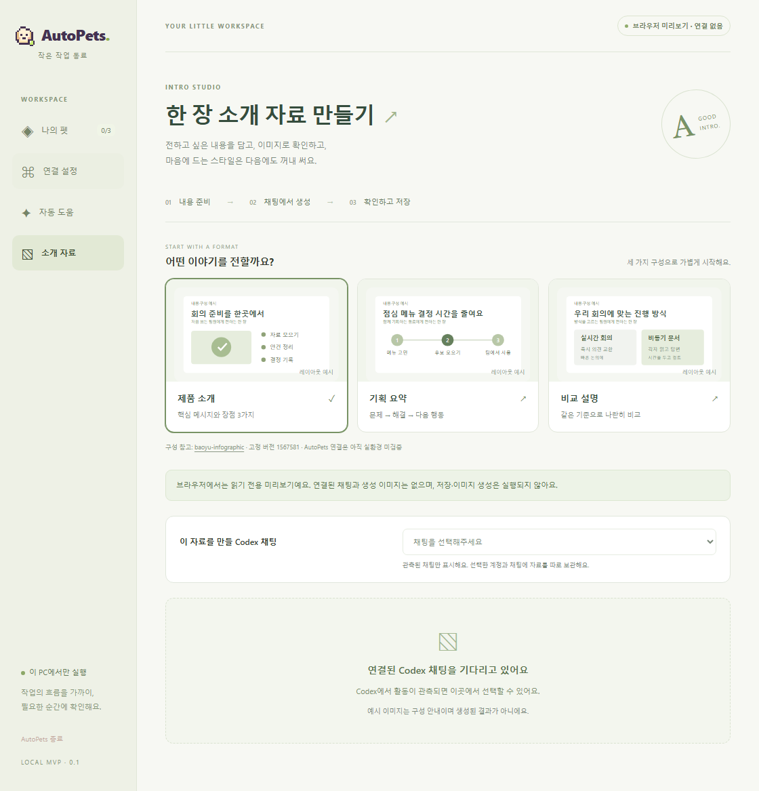

# 소개 자료 기능의 구현 검수

2026-09-23, `feat/intro-artifacts` 개발 브랜치의 로컬 검수입니다. 실제 Codex 연결·실제 사용자 효과 검증과 구분합니다.

| 검사 | 결과 | 의미 |
|---|---|---|
| 전체 Node 검사 | 160개 통과 | 기존 연결·공통 규칙·설치 패키징과 새 자료 CLI/계약/평가 준비, Windows 축약 경로 회귀 검사 |
| 전체 Rust 검사 | 95개 통과 | Windows MSVC 테스트 실행. 저장·인증·PNG·개정·과거 버전·채팅 분리 |
| 프런트엔드 | 타입 검사·프로덕션 빌드 통과 | 새 소개 자료 화면 포함 |
| 전체 UI | 38개 시나리오, 페이지 오류 0 | 기존 펫·설정·시작 흐름 + 소개 자료 7개 묶음 |
| 소개 자료 화면 재검사 | 7개 묶음, 페이지 오류 0 | 내용이 있는 예시 카드·작업 선택·수정·저장 화면 |
| 구조·문서 링크 | 통과 | 기존 앱 식별자·공개 데모·문서 링크 유지 |
| 평가 자료 | 72개 빈 실행표 생성 | 6개 한국어 사례 × 4조건 × 3회. 실행 결과 없음 |

CLI는 한국어·공백 경로, 현재 턴 대조, 독립 패키지, 잘못된 PNG, 개정 충돌, 타임아웃 후 조회를 검사했습니다. 기본 출력은 64KiB 이하이고 과거 원문·로고 바이너리를 반복 출력하지 않습니다.

첫 Windows CI에서 발견된 `RUNNER~1` 축약 경로 문제를 수정했습니다. 같은 파일인지 확인하면서 실제 링크·정션은 거부하고, 작업 경로는 관측된 표기로 전달합니다. 별도의 Windows 축약 경로 검사를 추가했습니다.

UI는 합성 데이터와 앱 명령 모의 응답을 사용했습니다. Rust 검사는 실제 로컬 테스트 실행이며 정상 앱 설치·네이티브 창 검수의 대체 증거가 아닙니다. Windows 설치기 CI는 해당 개발 PR의 검사 결과를 따로 확인합니다. 기존 구현의 과거 검수 기록은 [기존 상태 파일](../implementation-status.json)에 그대로 남겨 둡니다.

## 검수 화면

첫 화면은 연결 없는 브라우저 미리보기입니다. 버전 비교 화면의 채팅·이미지는 **합성 검수 데이터**이며 실제 AI 생성 결과가 아닙니다.

[버전 비교·스타일 저장 화면](../images/app-intro-versions.png) · [좁은 화면 검수](../images/app-intro-compact.png)

## 남은 검증

- 실제 Windows Codex 두 채팅에서 준비 지침과 생성 PNG의 전달
- 이미지 생성 도구 접근·한국어 결과 품질·부분 수정 만족도
- 최초 설치와 다음 사용의 조작·시간·관측 가능한 전체 사용량
- 초심자 3명·숙련자 2명의 작업 완료 여부

자동 모델 변경, 공개 설치, 효과 측정은 완료로 표시하지 않습니다. [평가 방법](intro-evaluation.md)
